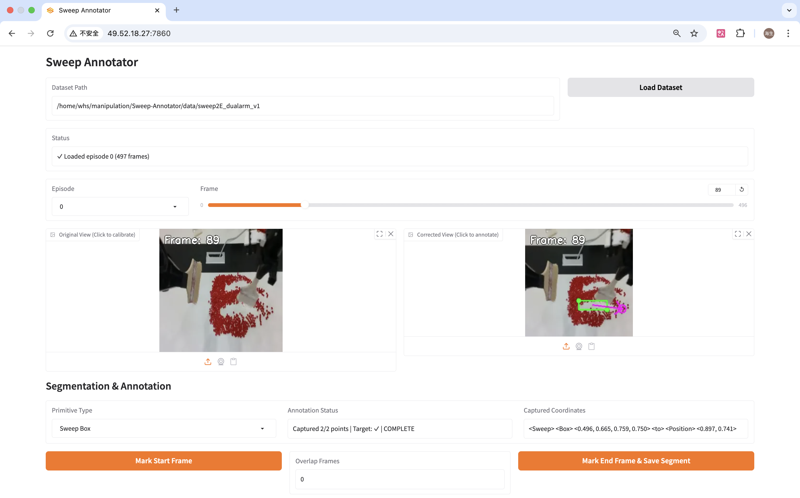

# Sweep Annotator

A Gradio-based GUI tool for annotating robot manipulation trajectories with primitive actions. This tool enables efficient annotation of sweeping, clearing, and refinement primitives on LeRobot format datasets with perspective correction capabilities.



## Features

- Load/export annotated datasets in LeRobot format
- Interactive GUI for trajectory annotation
- Support for multiple primitive types (Sweep Box, Sweep Triangle, Clear Box, Refine Line, Refine Arc)
- Perspective correction/calibration for top-down view
- Segment-based annotation with frame ranges
- Save/load annotation progress
- Visual feedback during annotation process

## Installation

1. Clone this repository:
```bash
git clone <repository-url>
cd Sweep-Annotator
```

2. Create virtual environment:
```bash
conda create -n sweep-annotator python=3.11 -y
conda activate sweep-annotator
```

3. Install dependencies:
```bash
pip install -r requirements.txt
```

4. Launch the application:
```bash
python main.py
```

By default, the GUI will be available at `http://localhost:7860`.

You can customize the Gradio server using the following command line arguments:

- `--share`  
  Enable public sharing link (Gradio will provide a public URL).
- `--server`  
  Specify the server IP or hostname (default: `0.0.0.0`).
- `--port`  
  Specify the port to run the Gradio app on (default: `7860`).

## Dataset Format

This tool expects datasets in LeRobot format with the following structure:

```
dataset_path/
├── meta/
│   ├── info.json           # Dataset metadata (fps, camera names, etc.)
│   └── episodes.jsonl      # Episode metadata
├── data/
│   └── chunk-*/
│       └── episode_*.parquet
└── videos/
    └── chunk-*/
        └── observation.images.*/
            └── episode_*.mp4
```

## Usage Guide

### 1. Loading a Dataset

1. **Enter Dataset Path**: In the "Dataset Path" field, enter the full path to your LeRobot dataset directory
   - Example: `/path/to/lerobot/dataset`

2. **Click "Load Dataset"**: The tool will:
   - Load dataset metadata
   - Populate the episode dropdown with available episodes
   - Display status message indicating success or errors

3. **Select Episode**: Choose an episode from the dropdown menu
   - The first frame will automatically load in both Original and Corrected views
   - Frame slider will be configured based on episode length

### 2. Perspective Calibration

Calibration is recommended for accurate top-down annotations. This step corrects the camera perspective to create a normalized view.

**Steps:**

1. **Navigate to First Frame**: Use the frame slider to go to frame 0 (or any frame with clear view of the workspace)

2. **Click "Set Calibration Points"**: This enters calibration mode
   - Status will show: "Calibration mode active. Click 4 points on the ORIGINAL image..."

3. **Click 4 Points on Original Image** (left side):
   - **Point 1**: Top-left corner of workspace
   - **Point 2**: Top-right corner of workspace
   - **Point 3**: Bottom-right corner of workspace
   - **Point 4**: Bottom-left corner of workspace

   **The order matters!** Always go: top-left → top-right → bottom-right → bottom-left

4. **Auto-Apply**: After the 4th point, calibration automatically applies
   - Corrected view updates to show the perspective-corrected image
   - Status shows: "Calibration complete!"

5. **Save/Load Calibration** (Optional): Click "Save Calibration" to save calibration points
   - Saves to `<dataset_path>/calibration.json`
   - Can be reloaded later with "Load Calibration"

**Calibration Tips:**
- Choose a frame with clear workspace boundaries
- Points should form a quadrilateral around your workspace
- Once calibrated, all frames will use the same correction
- Corrected view will be 224x224 pixels

### 3. Annotating Trajectories

#### Understanding Segments

A **segment** is a portion of a trajectory (range of frames) with a single primitive annotation. Each segment contains:
- Start frame and end frame
- Primitive type and coordinates
- Optional target position
- Optional overlap with next segment

#### Annotation Workflow

**Step 1: Select Primitive Type**
- Choose from the "Primitive Type" dropdown:
  - **Sweep Box**: Sweeping action within a box (4 corner points + target)
  - **Sweep Triangle**: Sweeping within a triangle (3 corner points + target)
  - **Clear Box**: Clearing action within a box (4 corner points, no target)
  - **Refine Line**: Refinement along a line (2 endpoints, no target)
  - **Refine Arc**: Refinement along an arc (3 points defining the arc, no target)

**Step 2: Mark Start Frame**
1. Move frame slider to the starting frame of the segment
2. Click "Mark Start Frame"
3. Status will show: "Started segment at frame X"

**Step 3: Click Points on Corrected Image** (right side)
- The number of points depends on primitive type:
  - **Box**: 4 corner points (top-left, top-right, bottom-right, bottom-left)
  - **Triangle**: 3 corner points
  - **Line**: 2 endpoints
  - **Arc**: 3 points defining the arc

- **Visual Feedback**:
  - Red circles show clicked points
  - Green circle shows target position (for Sweep primitives)
  - Lines connect the points to show the shape

- **Status Display**: Shows progress like "Captured 2/4 points"

- **Coordinates Display**: Shows captured coordinates in normalized format [0-1]

**Step 4: Add Target Position** (Sweep primitives only)
- After capturing all shape points, click one more time for the target position
- This indicates where the swept material should end up
- Status will show: "Captured 4/4 points + target position"

**Step 5: Mark End Frame**
1. Move frame slider to the ending frame of the segment
2. Click "Mark End Frame & Save Segment"

**Step 6: Segment Saved**
- The segment appears in the "Segment List" table
- Shows: Episode, Start Frame, End Frame, Primitive type, and Coordinate string
- Annotation status resets for the next segment

#### Annotation Controls

- **Reset Points**: Clear all clicked points and start over (keeps start frame)
- **Undo Last Point**: Remove the most recent point clicked
- **Click on Corrected Image**: Add annotation points
- **Frame Slider**: Navigate through frames (doesn't affect annotation)

#### Primitives Visualization Tool

The Primitives Visualization Tool allows you to test and visualize primitive strings before or after annotation:

1. **Enter Primitive String**: In the "Primitive String" input box, enter a correctly formatted primitive string
   - Coordinates must be in [0, 1] range (floats with 3 decimal places)
   - Example: `<Sweep> <Box> <0.447, 0.893, 0.804, 0.893> <to> <Position> <0.500, 0.500>`

2. **Click "Visualize"**: The primitive will be visualized on the corrected video display
   - Shows the same visual representation as during annotation (points, lines, boxes, etc.)
   - Useful for verifying coordinate values or testing primitive strings

3. **Status Message**: Shows whether visualization succeeded or if there were errors in the format

**Supported Formats:**
- `<Sweep> <Box> <x1, y1, x2, y2, x3, y3, x4, y4> <to> <Position> <xt, yt>` (coordinates in [0, 1] range)
- `<Sweep> <Triangle> <x1, y1, x2, y2, x3, y3> <to> <Position> <xt, yt>` (coordinates in [0, 1] range)
- `<Clear> <Box> <x1, y1, x2, y2, x3, y3, x4, y4>` (coordinates in [0, 1] range)
- `<Refine> <Line> <x1, y1, x2, y2>` (coordinates in [0, 1] range)
- `<Refine> <Arc> <x1, y1, x2, y2, x3, y3>` (coordinates in [0, 1] range)

#### Snapshot Feature

The Snapshot feature allows you to save individual frames as images:

1. **Navigate to Desired Frame**: Use the frame slider to select the frame you want to save

2. **Click "Snapshot"**: The current frame will be saved to `data/<dataset_name>/snapshot/` directory
   - Filename format: `snapshot-<dataset name>-<episode index>-<frame index>.png`
   - Example: `snapshot-sweep2E_dualarm_v1-0-42.png`

3. **Image Type**:
   - If calibration is applied: Saves the calibrated (perspective-corrected) image
   - If no calibration: Saves the original dataset image

4. **Status Message**: Shows the full path where the snapshot was saved

**Use Cases:**
- Documenting specific frames for reference
- Creating training examples
- Debugging annotation issues
- Visual dataset documentation

#### Coordinate Format

Coordinates are stored in normalized format [0, 1] (floats with 3 decimal places) and displayed as:
```
<Primitive> <Shape> <x1, y1, x2, y2, ...> <to> <Position> <xt, yt>
```

Example:
```
<Sweep> <Box> <0.447, 0.893, 0.804, 0.893, 0.804, 0.179, 0.447, 0.179> <to> <Position> <0.500, 0.500>
```

### 4. Managing Segments

#### Segment List Table

The segment list shows all annotated segments across all episodes with a numbered index:

| Index | Episode | Start Frame | End Frame | Primitive | String |
|-------|---------|-------------|-----------|-----------|--------|
| 1 | 0 | 10 | 50 | sweep_box | \<Sweep\> \<Box\> ... |
| 2 | 0 | 45 | 80 | clear_box | \<Clear\> \<Box\> ... |
| 3 | 1 | 0 | 30 | refine_line | \<Refine\> \<Line\> ... |

#### Deleting Segments

To delete one or more segments, use the deletion interface below the segment list:

1. **Enter Indices**: In the "Indices to Delete" text box, type the indices of segments you want to delete
   - Single index: `2` (deletes segment at index 2)
   - Multiple indices: `2, 3, 5` (deletes segments at indices 2, 3, and 5)
   - Range: `4-6` (deletes segments at indices 4, 5, and 6)
   - Combined: `2, 4-6, 8` (deletes segments at indices 2, 4, 5, 6, and 8)

2. **Click Delete Button**: Press the "Delete" button to remove the specified segments

3. **Confirmation**: The "Delete Status" field shows how many segments were deleted and how many remain

**Examples:**
- Delete segment 2: Enter `2` and click Delete
- Delete segments 3, 4, 5: Enter `3-5` and click Delete
- Delete segments 1, 3, and 7 through 10: Enter `1, 3, 7-10` and click Delete

**Note**: This action cannot be undone unless you reload saved annotations.

### 5. Interrupt and Resume

You can save your progress and resume annotation later.

#### Saving Annotations

1. Click "Save Annotations"
2. Annotations save to `<dataset_path>/annotations.json`
3. Status shows: "Saved X annotations to ..."

**What's saved:**
- All segment data (frames, primitive types, coordinates)
- Episode IDs and timestamps
- Target positions

#### Loading Annotations

1. Click "Load Annotations"
2. Loads from `<dataset_path>/annotations.json`
3. All segments appear in the Segment List
4. Status shows: "Loaded X annotations from ..."

**Workflow for Resuming:**
1. Launch the application
2. Load the dataset
3. Load calibration (if previously saved)
4. Load annotations
5. Continue annotating new segments

### 6. Exporting Annotated Dataset

After completing annotations, export the processed dataset.

**Steps:**

1. **Enter Output Path**: Specify where to save the exported dataset
   - Example: `/path/to/output/annotated_dataset`

2. **Select Export Mode**: Choose between "Original" or "Masked"
   - **Original**: Export videos as-is (with perspective correction if calibrated)
   - **Masked**: Export videos with primitives visualized on each frame of the main camera
     - Primitives are rendered directly onto video frames
     - Green overlays show boxes, triangles, or lines
     - Purple/magenta markers indicate target positions
     - Visualization matches what you see in the "Visualize" tool

3. **Click "Export Annotated Dataset"**

**Verifying Export:**

After export completes, you can verify that task_index values are correctly set:

```bash
python verify_task_index.py /path/to/output/annotated_dataset
```

This script will:
- Show all task definitions from `tasks.jsonl`
- Display task_index statistics for each episode
- Check parquet files to verify task_index values
- Report if there are any issues

**What happens during export:**
- Creates new LeRobot format dataset at output path
- Splits episodes into segments based on annotations
- Applies perspective correction to all frames
- Copies and processes robot state/action data
- Creates new episode files for each segment

**Export Output Structure:**
```
output_path/
├── meta/
│   ├── info.json              # Dataset metadata
│   ├── episodes.jsonl         # One episode per segment (episode_index, tasks, length)
│   ├── episodes_stats.jsonl   # Per-episode statistics
│   └── tasks.jsonl            # Task definitions (each unique primitive string)
├── data/
│   └── chunk-*/
│       └── episode_*.parquet  # State/action data per segment
└── videos/
    └── chunk-*/
        └── observation.images.*/
            └── episode_*.mp4    # Corrected video per segment
```

**Note**: The exported dataset follows LeRobot 2.1 format strictly. Each episode in `episodes.jsonl` contains only `episode_index`, `tasks`, and `length` fields. Statistics for each episode are stored separately in `episodes_stats.jsonl`.

**Important Details:**

1. **Task Indexing**: The `task_index` column in exported parquet files correctly maps to tasks defined in `tasks.jsonl`. Each unique primitive string (including coordinates) is assigned a unique task_index (0, 1, 2, ...). The export process uses a two-phase approach:
   - Phase 1: Collects all unique tasks and creates task_index mapping
   - Phase 2: Exports segments in parallel with correct task_index values

2. **Task Format**: The `tasks` field in `episodes.jsonl` contains the complete primitive string representation (e.g., `["<Sweep> <Box> <0.447, 0.893, 0.804, 0.893> <to> <Position> <0.500, 0.500>"]`). Each unique primitive string is treated as a separate task in `tasks.jsonl`.

3. **Parallel Export**: The export process uses multiprocessing (default: 8 workers) to speed up video encoding and data processing. You can adjust the number of workers by modifying the `num_workers` parameter in the export function.

**Console Output**: Progress messages show which segments are being processed:
```
[1/10] Processing segment Episode 0, frames 10-50
[2/10] Processing segment Episode 0, frames 45-80
...
```

### 7. GUI Information Display

The interface provides real-time information:

#### Status Fields

- **Status** (top): Dataset loading status, episode loading status
- **Calibration Status**: Calibration progress and confirmation
- **Annotation Status**: Point capture progress, segment saving status
- **Captured Coordinates**: Real-time coordinate display
- **Delete Status**: Segment deletion confirmation
- **Annotations Status**: Save/load operation results
- **Export Status**: Export progress and completion

#### Visual Information

**Original View (Left)**:
- Shows raw camera feed
- Used for calibration point selection
- Displays frame number overlay
- Click here only during calibration

**Corrected View (Right)**:
- Shows perspective-corrected image (224x224)
- Used for annotation point selection
- Shows visual annotation overlay:
  - **Red circles**: Captured shape points
  - **Green circle**: Target position
  - **Lines**: Connect points to show shape
- Displays frame number overlay
- Click here for annotations

**Frame Slider**:
- Shows current frame number
- Range: 0 to (total_frames - 1)
- Can freely navigate without affecting annotation

**Segment List**:
- Real-time updates as segments are added
- Shows all episodes and their segments with index numbers
- Use the deletion interface below the table to remove segments

## Tips and Best Practices

1. **Calibrate Once**: Save calibration and reuse it for the entire dataset if camera doesn't move

2. **Consistent Point Order**: Always click points in consistent order (e.g., top-left, top-right, bottom-right, bottom-left for boxes)

3. **Frame Selection**: Choose start/end frames where the action clearly begins/ends

4. **Save Frequently**: Use "Save Annotations" regularly to avoid losing work

5. **Visual Verification**: After clicking points, verify the visualization matches your intent

6. **Segment Deletion**: Use the index-based deletion interface to safely remove multiple segments at once

7. **Primitives Visualization**: Use the visualization tool to test and verify primitive strings

8. **Snapshots**: Save important frames as reference images using the Snapshot button

## Troubleshooting

### Dataset won't load
- Verify the dataset path is correct
- Check that `meta/info.json` exists
- Ensure LeRobot format is correct

### Calibration points not working
- Make sure you click on the **Original** (left) image, not the Corrected one
- Click exactly 4 points in order
- Try again with "Set Calibration Points"

### Annotation points not appearing
- Ensure you clicked "Mark Start Frame" first
- Click on the **Corrected** (right) image, not the Original one
- Check that Annotation Status shows segment is active

### Export fails
- Verify output path is writable
- Check that all segments have valid frame ranges
- Ensure calibration is set

### Segments missing after reload
- Make sure you clicked "Save Annotations" before closing
- Check that `annotations.json` exists in dataset directory
- Verify the dataset path is correct when loading

## Technical Details

### Export Process Architecture

The export process follows a two-phase architecture to ensure correct `task_index` assignment while maintaining parallel processing efficiency:

#### Phase 1: Task Index Mapping
1. Collects all unique primitive strings from all segments
2. Creates a sorted mapping: `{primitive_string: task_index}`
   - Example: `{"<Sweep> <Box> <0.1, 0.2, ...>": 0, "<Clear> <Box> <0.3, 0.4, ...>": 1}`
3. This ensures consistent task_index assignment across all episodes

#### Phase 2: Parallel Export
1. Each segment is exported by a separate worker process
2. Worker receives:
   - Segment data (frames, primitive, coordinates)
   - Pre-computed task_index for this segment
   - Video processor and perspective corrector data
3. Worker sets `task_index` column in parquet data before saving
4. Multiple workers run concurrently (default: 8 workers)

#### Key Design Decisions

**Why Two-Phase?**
- We need to know all unique tasks before assigning indices
- But we want to export segments in parallel for performance
- Solution: First phase builds the mapping, second phase uses it

**task_index in Parquet Files:**
- Each row in the parquet file has a `task_index` column
- All rows in one episode have the same `task_index`
- The index maps to the task definition in `meta/tasks.jsonl`

**Task Definition:**
- In `tasks.jsonl`: `{"task_index": 0, "task": "<Sweep> <Box> <0.447, 0.893, ...>"}`
- In `episodes.jsonl`: `{"episode_index": 0, "tasks": ["<Sweep> <Box> <0.447, 0.893, ...>"], "length": 123}`
- The task string includes the full primitive specification with coordinates

### Data Processing Pipeline

```
Annotated Segments
       ↓
Phase 1: Build task_to_index mapping
       ↓
Phase 2: Parallel export (8 workers)
       ↓
   ┌───────┬───────┬───────┬───────┐
Worker 1  Worker 2  Worker 3  ...  Worker 8
   ↓       ↓       ↓             ↓
- Extract segment data
- Set correct task_index
- Apply perspective correction
- Export video segment
- Save parquet file
       ↓
Results collected and sorted
       ↓
Compute statistics
       ↓
Generate metadata files
```

### Exported Dataset Fields

Each parquet file contains the following columns:

| Column | Type | Description |
|--------|------|-------------|
| `index` | int | Global frame index (reset per episode) |
| `episode_index` | int | Episode number in exported dataset |
| `frame_index` | int | Frame number within episode |
| `timestamp` | float | Time in seconds (reset to 0 per episode) |
| `task_index` | int | Index of task in tasks.jsonl |
| `action` | array | Robot action vector |
| `observation.state` | array | Robot state vector |
| `observation.images.*` | reference | Video frame reference |

**Modification from Original Data:**
- `episode_index`: Updated to new episode number
- `frame_index`: Reset to start from 0
- `timestamp`: Reset to start from 0
- `index`: Reset to start from 0
- `task_index`: **Set to correct value** based on segment's primitive

### Understanding task_index Statistics

**Important:** When reviewing `episodes_stats.jsonl`, it's normal to see statistics like:
```json
"task_index": {"min": [0], "max": [0], "mean": [0.0], "std": [0.0], "count": [32]}
```

This is **expected behavior** because:

1. Each episode corresponds to **one segment** (one task)
2. All rows within an episode have the **same task_index**
3. Therefore: `min = max = mean`, and `std = 0.0`

**How to verify correctness:**

✅ **Correct scenario:**
```json
Episode 0: "task_index": {"min": [0], "max": [0], "mean": [0.0], ...}
Episode 1: "task_index": {"min": [1], "max": [1], "mean": [1.0], ...}
Episode 2: "task_index": {"min": [0], "max": [0], "mean": [0.0], ...}
Episode 3: "task_index": {"min": [2], "max": [2], "mean": [2.0], ...}
```
Different episodes have different task_index values (0, 1, 2) based on their tasks.

❌ **Problem scenario:**
```json
Episode 0: "task_index": {"min": [0], "max": [0], "mean": [0.0], ...}
Episode 1: "task_index": {"min": [0], "max": [0], "mean": [0.0], ...}
Episode 2: "task_index": {"min": [0], "max": [0], "mean": [0.0], ...}
```
All episodes have task_index=0, but `tasks.jsonl` defines multiple different tasks.

**Use the verification script** to check your exported dataset:
```bash
python verify_task_index.py /path/to/exported/dataset
```

## Data Format Reference

### Primitive Types

1. **Sweep Box**: `<Sweep> <Box> <x1,y1, x2,y2, x3,y3, x4,y4> <to> <Position> <xt,yt>`
2. **Sweep Triangle**: `<Sweep> <Triangle> <x1,y1, x2,y2, x3,y3> <to> <Position> <xt,yt>`
3. **Clear Box**: `<Clear> <Box> <x1,y1, x2,y2, x3,y3, x4,y4>`
4. **Refine Line**: `<Refine> <Line> <x1,y1, x2,y2>`
5. **Refine Arc**: `<Refine> <Arc> <x1,y1, x2,y2, x3,y3>`

All coordinates are normalized to [0, 1] range (floats with 3 decimal places).

## Changelog

### Version 2.2 (Current)

**New Features:**
- **Masked Export Mode**: Export datasets with primitive visualizations rendered on video frames
  - Added "Export Mode" dropdown in the Export section with "Original" and "Masked" options
  - When "Masked" mode is selected, primitives are drawn on each frame of the main camera video
  - Visualization includes:
    - Shape outlines (boxes, triangles, lines, arcs) in green
    - Target position markers in purple/magenta (for Sweep primitives)
    - Arrows connecting shapes to targets
  - Works with both calibrated (perspective-corrected) and uncalibrated videos
  - Other camera views (wrist cameras) remain unchanged
  - Enables visual verification of primitives in exported videos

**Technical Details:**
- Modified `export_dataset()` function in `main.py` to accept export mode parameter
- Updated `export_all_segments()` in `modules/data_exporter.py` to support `masked_export` parameter
- Enhanced `_export_segment_worker()` to render primitives on main camera frames using `PrimitiveAnnotator`
- Primitive rendering uses the same visualization logic as the interactive annotation tool
- All frames in a segment show the same primitive annotation consistently

### Version 2.1

**Breaking Changes:**
- **Coordinate Normalization Reverted**: Changed back from [0, 1000] integer to [0, 1] float format
  - Coordinates are now stored as floats with 3 decimal places (e.g., 0.447, 0.893)
  - Maintains the same effective precision as Version 1.0
  - All Version 2.0 annotations need to be re-annotated or converted
  - Affects all primitive strings, coordinate storage, and visualization

**Key Changes from Version 2.0:**
- All coordinate handling functions updated to use [0, 1] normalization
- Primitive strings now display float coordinates with 3 decimal places
- Updated coordinate utilities, visualization, and export logic
- Updated documentation to reflect float coordinate format

**Features (Inherited from Version 2.0):**
- **Primitives Visualization Tool**: Interactive tool to visualize primitive strings
  - Located between annotation controls and segment list
  - Supports all primitive types with [0, 1] coordinate format
  - Provides real-time visual feedback for testing primitive strings
  - Useful for debugging and verifying annotations

- **Snapshot Feature**: Save individual frames as images
  - New "Snapshot" button positioned between "Mark Start Frame" and "Mark End Frame"
  - Saves to `data/<dataset_name>/snapshot/` directory
  - Filename format: `snapshot-<dataset name>-<episode index>-<frame index>.png`
  - Automatically uses calibrated image if calibration is applied
  - Useful for documentation and reference

- **No Overlap Frames**: Overlap Frames feature remains removed from Version 2.0
  - Segments do not support overlapping frame ranges
  - Simplified segment model and export process

**Improvements:**
- Consistent coordinate representation matching original Version 1.0 format
- Improved precision with explicit 3-decimal place formatting
- Updated all documentation with correct coordinate examples
- Better compatibility with standard normalized coordinate conventions

### Version 2.0

**Breaking Changes:**
- **Coordinate Normalization**: Changed from [0, 1] float to [0, 1000] integer format
  - NOTE: This was reverted in Version 2.1

**Removed Features:**
- **Overlap Frames**: Removed the "Overlap Frames" input and functionality

**New Features:**
- **Primitives Visualization Tool**: Interactive tool to visualize primitive strings
- **Snapshot Feature**: Save individual frames as images

### Version 1.1

**Bug Fixes:**
- Fixed `task_index` column in exported parquet files being set to 0 for all episodes
  - Implemented two-phase export architecture to correctly map task strings to task indices
  - Phase 1 now collects all unique tasks and builds the task_index mapping before export
  - Phase 2 applies the pre-computed task_index to each segment during parallel export
  - All parquet files now have correct task_index values matching tasks.jsonl

**Improvements:**
- Enhanced export process with clear progress messages for task index mapping phase
- Added detailed technical documentation explaining the export architecture
- Improved code comments in data_exporter.py for better maintainability

### Version 1.0 (Initial Release)

**Features:**
- Initial release with Gradio-based GUI
- Support for 5 primitive types (Sweep Box, Sweep Triangle, Clear Box, Refine Line, Refine Arc)
- Perspective correction and calibration
- Multi-episode annotation support
- Save/load annotation progress
- Export to LeRobot 2.1 format
- Multi-process parallel export (8 workers)
- Segment deletion interface
